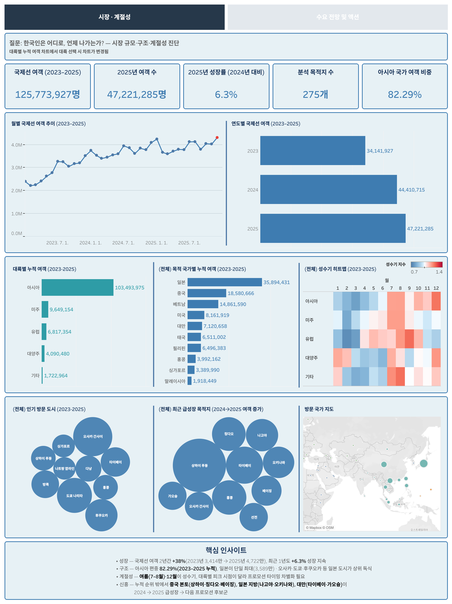
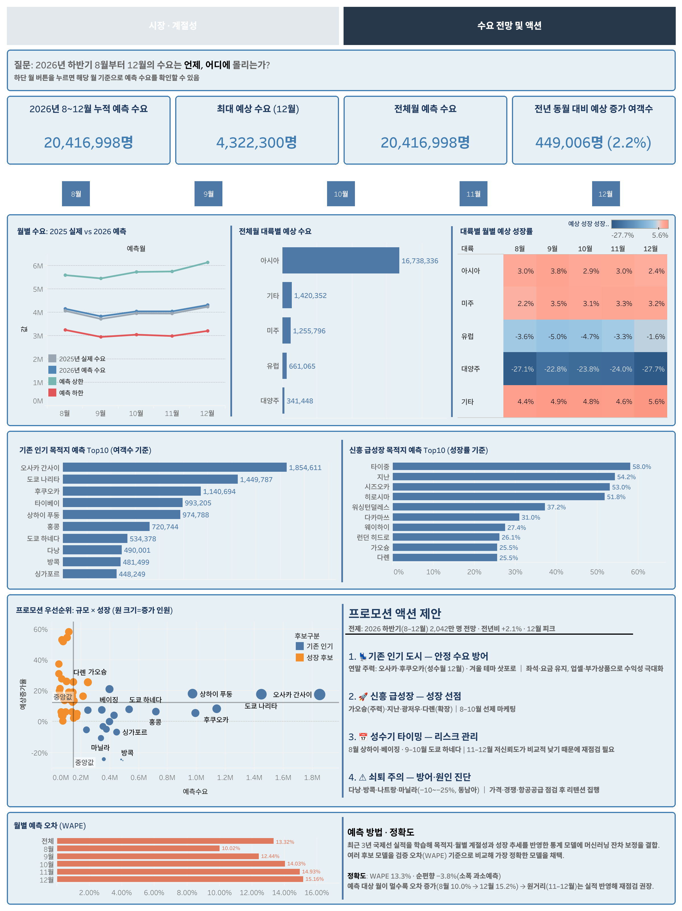

# 한국 국제선 여객 수요 분석

AirPortal 공개 데이터로 국제선 수요와 운항 안정성을 분석하고, 목적지별 월간 수요 예측을 프로모션 후보·시기와 연결한 데이터 분석 프로젝트.

---

## 프로젝트 배경

> **아래 상황은 공개 데이터를 실무처럼 다뤄 보기 위해 설정한 가상 시나리오다.** 실제 회사·담당자·업무 요청이 아니다.

**왜 이 분석을 시작했나**
해외여행 수요는 목적지와 계절에 따라 크게 달라진다. 해외여행 플랫폼의 마케팅팀이 **2026년 하반기 국제선 프로모션 편성안**을 준비한다고 가정했다. 한정된 캠페인 슬롯을 현재 인기 노선에만 배정하면 새롭게 성장하는 목적지를 놓칠 수 있고, 증가율만 보면 아직 시장 규모가 작은 목적지를 과대평가할 수 있다. 수요가 큰 시기에는 지연·취소 같은 운항 불편도 함께 확인해야 한다.

**어떻게 풀었나**
2023년 1월부터 2026년 7월까지의 국제선 통계로 시장 구조·계절성·최근 변화를 분석하고 목적지별 수요를 예측했다. 다음 질문을 하나의 의사결정 흐름으로 구성했다.

1. 지금까지 수요가 크고 꾸준한 **핵심 목적지**는 어디인가?
2. 목적지별 성수기는 언제이며, 최근 **성장하는 목적지**는 어디인가?
3. 앞으로 5개월의 수요는 어느 정도이고 예측을 얼마나 신뢰할 수 있는가?
4. 수요와 운항 안정성을 함께 볼 때, 어느 목적지를 어떤 시기에 홍보해야 하는가?

인천·김포 출발편 로그는 프로모션 후보의 운항 안정성을 확인하는 보조 정보로 사용했다.

**그래서, 무엇을 알게 됐나**
국제선 여객은 2023년 약 3,414만 명에서 2025년 약 4,722만 명으로 늘었지만 증가율은 2024년 30.08%에서 2025년 6.33%로 낮아졌다. 수요는 아시아(국가 기준 82.29%)에 크게 몰렸고, 2026년 8–12월 예측은 약 2,042만 명·12월 피크로 나타났다. 기존 인기 목적지(오사카·후쿠오카)와 신흥 성장 목적지(가오슝 등)를 분리하고, 규모는 크지만 성장이 꺾이는 동남아 노선(다낭·방콕·나트랑)은 방어 대상으로 구분했다.

> 실제 기업 과제가 아닌 공개 데이터를 활용한 개인 포트폴리오 프로젝트다.

---

## 한눈에 보기

| 구분 | 내용 |
|---|---|
| 분석 질문 | 어떤 목적지를 어느 시기에 프로모션해야 하는가? |
| 예측 단위 | 목적지 × 월 |
| 데이터 기준시점 | 프로젝트 수행 당시 공개된 최신 월은 2026년 7월 |
| 과거 데이터 | 2023년 1월–2025년 12월 국제선 통계 및 인천·김포 출발편 로그 |
| 고정 Test | 2026년 1월–7월 실제 수요 |
| 최종 예측 | 2026년 8월–12월, 169개 목적지 |
| 최종 모델 | 전년동월 수요 × 성장계수 + Ridge 최근 오차 보정 |
| 핵심 지표 | WAPE, 순편향, 상태 지연율, 15분 지연율, 취소율 |

---

## 대시보드

🔗 **[Tableau Public에서 인터랙티브 대시보드 보기](https://public.tableau.com/app/profile/.16528220/viz/_17883602708980/01)** — 상단 내비게이션으로 두 화면을 이동할 수 있다. 02의 상단 월 버튼으로 8–12월(또는 전체)을 선택하면 KPI와 대륙별 예상 수요가 해당 월 기준으로 갱신된다.

분석 결과를 단순 차트 모음이 아니라 `시장 진단 → 수요 예측 → 프로모션 결정` 흐름으로 연결했다. 애초 구상한 프로모션 액션 화면(03)은 수요 예측 화면(02)에 통합해 **2페이지**로 구성했다.

| 화면 | 확인할 질문 | 주요 내용 |
|---|---|---|
| 01 시장·계절성 | 한국인은 어디로, 언제 나가는가? | 월별·연도별 여객 추이, 대륙·국가·도시 순위, 대륙 × 월 성수기 지수, 최근 급성장 도시, 방문 국가 지도 |
| 02 수요 전망 & 액션 | 2026년 8–12월 수요는 언제·어디에 몰리는가? | 월별 예측(2025 실제 vs 2026 예측·예측 구간), 대륙별 예상 수요, 대륙 × 월 예상 성장률, 기존 인기·신흥 급성장 Top10, 규모 × 성장 프로모션 산점도, 액션 제안, 월별 예측 오차(WAPE) |

**01 · 시장·계절성**



**02 · 수요 전망 & 액션**



- **대시보드 파일**: `tableau/국제선_수요예측_대시보드.twbx` (데이터를 내장해 단독으로 열린다)
- **입력 데이터**: `tableau/export_tableau.py`로 재생성하며, 대시보드는 CSV 6종(`country_monthly`·`destination_monthly`·`forecast_monthly`·`market_monthly`·`model_performance`·`promotion_candidates`)에 연결한다.

---

## 데이터 개요

| 데이터 | 기간 | 주요 항목 | 활용 |
|---|---|---|---|
| [AirPortal 항공운송통계 상세조회](https://airportal.go.kr/stats/transport/chartDetail5.do) | 2023년 1월–2025년 12월 | 노선·항공사·공항·지역/국가별 월간 여객 수·운항편수 | 수요·계절성 분석, 모델 선택 |
| AirPortal 항공운송통계 상세조회 (노선) | 2026년 1월–7월 | 목적지별 월간 여객 수·운항편수 | 고정 Test, 최종 예측 기준월 갱신 |
| [AirPortal 항공기 출도착](https://www.airportal.go.kr/airport/aircraftInfo.do) | 2023년 1월–2025년 12월 | 인천·김포공항 출발편 로그: 항공사·편명·도착지·계획·예상·실제 출발시간·상태·지연원인 | 지연·취소·회항 분석 |

- 원본 Excel은 수정하지 않고 MySQL의 `raw_` 테이블에 적재한다.
- 파일 해시·행 수·적재 상태는 `meta_load_file`에 기록해 중복 적재를 통제한다.
- 예측 대상은 24개월 이상 관측된 169개 목적지이며 전체 여객의 약 99.1%를 포함한다.
- DB에 쓰인 목적지명을 유지하되, 보고서에서는 `삿보로 → 삿포로`처럼 익숙한 한글 표기를 함께 쓴다.

> 원본 Excel·MySQL 접속 정보·Tableau 입력 CSV는 공개 저장소에 포함하지 않는다.

---

## 핵심 결과

### 1. 시장 규모와 핵심 목적지

- 국제선 출발 여객은 2023년 약 **3,414만 명**에서 2025년 약 **4,722만 명**으로 늘었다. 다만 증가율은 2024년 30.08%에서 2025년 6.33%로 낮아져, 회복기 성장과 최근 성장을 구분할 필요가 있었다.
- 인천공항은 3개년 전체 수요의 **79.11%**를 차지했지만 연간 비중은 2023년 81.29%에서 2025년 77.49%로 낮아졌다. 누적 1위라는 사실만으로 최근 시장 변화까지 같다고 볼 수는 없다.
- 일본·중국·베트남이 주요 목적 국가였고, 목적지에서는 간사이, 노선에서는 인천→도쿄 나리타가 3개년 누적 수요 1위였다.
- 누적 인기·2025년 최신 수요·최근 성장 기준을 합치면 후보가 17개로 늘어, 기존 인기 목적지와 새롭게 성장하는 목적지를 분리해 탐색했다. ([03](notebooks/03_eda.ipynb) · [04](notebooks/04_business_metrics.ipynb))

### 2. 계절성과 최근 성장

- 전체 계절지수는 **12월이 1.1448로 가장 높고 7–8월도 평균을 웃돌아**, 여름과 연말이 주요 프로모션 시기로 나타났다.
- 목적지마다 성수기는 달랐다. 간사이는 12월 계절지수가 1.1742였고, 방콕은 1월 1.2531에서 5월 0.8476으로 차이가 커 같은 캠페인 달력을 적용하기 어려웠다.
- 푸동은 2024년 대비 2025년 여객이 약 41만 명 늘었으며, 여객 증가율 28.41%가 운항 증가율 15.05%보다 높았다. 최근 성장 후보는 증가율뿐 아니라 증가 인원·기존 규모·운항편 변화를 함께 봐야 했다. ([03](notebooks/03_eda.ipynb) · [04](notebooks/04_business_metrics.ipynb))

### 3. 운항 안정성

- 2025년 12월의 **상태 지연율은 19.13%, 15분 지연율은 79.22%**로 60.09%p 차이가 났다. 두 지표는 계산 기준이 달라 평균내거나 하나의 지연율로 합치지 않았다.
- 간사이 여객은 2024년보다 2025년에 늘었지만 상태 지연율은 30.18%에서 24.16%로 낮아졌다. 관찰 범위에서는 수요 증가와 운항 불편이 항상 같은 방향으로 움직이지 않았다.
- 따라서 목적지 수요는 **홍보 대상을 찾는 기준**, 지연·취소·회항은 **여행 선택 시 참고할 운영 정보**로 역할을 분리했다. ([04](notebooks/04_business_metrics.ipynb))

### 4. 수요 예측

2025년 1월–7월을 기준월로 롤링 Validation을 진행하고, 각 시점까지 확인된 자료만으로 다음 1–5개월을 예측했다. 후보와 설정을 확정한 뒤에는 미사용 2026년 실제값으로 최종 모델 하나만 Test했다.

| 모델 | Validation WAPE | 결과 |
|---|---:|---|
| 최근 3개월 평균 | 15.72% | 계절 변화에 취약 |
| B0 전년동월 | 14.09% | 계절성을 반영한 기준선 |
| B1 전년동월 × 성장계수 | 11.84% | 최근 성장 추세를 추가해 개선 |
| **B1 + Ridge 잔차보정** | **11.47%** | Validation 최저, 최종 채택 |
| XGBoost | 11.57% | Ridge보다 소폭 높음 |
| LightGBM / HistGradientBoosting | 11.59% | 복잡도 대비 추가 개선 없음 |

최종 모델의 2026년 1–7월 Test WAPE는 **13.32%**, 순편향은 **−3.82%**였다. 같은 구간에서 참조 기준선을 함께 계산하면 B0 전년동월 16.65%, **B1 전년동월×성장 12.19%(순편향 −0.28%)** 다. 확정 모델은 B0보다는 크게 나았지만 Validation에서 0.37%p 앞섰던 B1에는 새 기간에서 오히려 뒤졌고, 순편향도 사실상 전부 Ridge 층에서 나왔다. 다만 선택 근거는 전부 Validation 자료였고 Test는 보지 않았으므로 사후 선택 편향은 없다. Test 결과로 모델을 바꾸지 않는다는 원칙에 따라 최종 모델과 8월 사전등록 예측값은 그대로 두었다. WAPE는 전체 수요량을 고려한 통합 오차율로 낮을수록 좋고, 순편향이 음수면 전체적으로 과소예측했다는 뜻이다. ([05](notebooks/05_demand_forecast.ipynb))

### 5. 2026년 8–12월 예측과 프로모션 후보

| 예측월 | 총예측 수요 |
|---|---:|
| 2026년 8월 | 약 416만 명 |
| 2026년 9월 | 약 384만 명 |
| 2026년 10월 | 약 405만 명 |
| 2026년 11월 | 약 405만 명 |
| 2026년 12월 | 약 432만 명 |

5개월 합계는 약 **2,042만 명**이며 예측 구간은 약 1,547만–2,871만 명이다. 12월 수요가 가장 높지만, 11–12월은 예측 거리가 길어 실제 예약·좌석 자료가 쌓이는 시점에 다시 확인해야 한다.

대륙 단위로 보면 아시아·미주·기타는 성장하지만 유럽·대양주는 역성장이 예측됐다. 특히 기존 인기 동남아 노선(다낭·방콕·나트랑 −25%대)이 두 자릿수 감소로 나타나, 규모 상위권이라도 신규 프로모션보다 원인 진단과 이탈 방어가 우선이다.

- **기존 인기 목적지**: 오사카 간사이·후쿠오카는 연말 주력 후보, 도쿄 하네다는 10월, 삿포로는 겨울 테마 후보로 제안했다.
- **성장 목적지**: 가오슝은 규모와 증가 지속성이 함께 확인된 우선 후보다. 지난·광저우·다롄은 확장형, 타이중·히로시마·시즈오카는 탐색형 후보로 구분했다.
- **쇠퇴 주의**: 다낭·방콕·나트랑·마닐라 등 감소 예측 동남아 노선은 방어·원인 진단 대상으로 분리했다.
- **운항 안정성**: 상태값 기준 지연율과 실제 출발시각 기준 15분 지연율은 정의가 다르므로 합치지 않고 각각 제시했다. ([05](notebooks/05_demand_forecast.ipynb))

#### 2026년 8월 예측 사후 점검 — 데이터 업데이트 대기

**왜 이미 지난 8월을 예측했나?** 프로젝트 수행 당시 AirPortal에서 확인할 수 있는 최신 월간 통계가 2026년 7월까지였기 때문이다. 따라서 달력상 8월이 지난 뒤라도 모델이 쓸 수 있는 마지막 실제값은 7월이었고, 8월은 아직 정답이 공개되지 않은 첫 예측 대상월이었다. 과거 데이터를 일부러 제외한 것이 아니라 월간 통계의 공개 시차를 반영한 것이다.

2026년 7월까지의 자료로 만든 8월 예측을 **4,159,692명으로 고정**해 두고, AirPortal의 8월 실제값이 공개되면 아래 빈칸만 갱신한다. 실제값을 본 뒤 모델이나 예측값을 바꾸지 않고 사후 성능만 기록해, 공개 전 예측이 얼마나 정확했는지 확인한다.

| 점검 항목 | 값 |
|---|---:|
| 예측 기준월 | 2026년 7월 |
| 2026년 8월 예측 수요 | **4,159,692명** |
| 예측 구간(q10–q90) | 3,255,413–5,601,758명 |
| 2026년 8월 실제 수요 | _데이터 공개 후 입력_ |
| 절대오차 | _실제값 입력 후 계산_ |
| APE(8월 오차율) | _실제값 입력 후 계산_ |
| 예측 구간 포함 여부 | _실제값 입력 후 판정_ |
| 결과 해석 | _과대·과소예측 여부와 원인 후보 기록_ |

`절대오차 = |실제수요 − 예측수요|`, `APE = 절대오차 ÷ 실제수요`로 계산한다. 8월 한 달의 APE는 전체 Test WAPE와 별개의 사후 점검 지표다.

---

## 권장 액션

1. 8월에는 상하이 푸동·베이징을 단기 수요 대응 후보로 검토한다.
2. 9–10월에는 도쿄 하네다를 운영하면서 오사카 간사이·후쿠오카·삿포로의 연말 캠페인을 준비한다.
3. 가오슝은 주력 성장 캠페인으로 검토하고, 지난·광저우·다롄은 좌석 연계형 프로모션으로 확장한다.
4. 타이중·히로시마·시즈오카는 ‘떠오르는 지방도시’ 숏폼·여행코스 콘텐츠를 소규모 집행한 뒤 클릭률·저장률·예약 전환으로 확대 여부를 판단한다.
5. 다낭·방콕·나트랑 등 감소 예측 동남아 노선은 가격·경쟁·좌석 공급을 진단한 뒤 리텐션 중심으로 대응한다.
6. 11–12월은 예약률·좌석·가격 정보가 추가되는 시점에 예측과 우선순위를 갱신한다.

---

## 분석 구조

| 번호 | 노트북 | 역할 |
|---:|---|---|
| 00 | [`00_elt_pipeline.ipynb`](notebooks/00_elt_pipeline.ipynb) | 원본 Excel 검증 및 MySQL 적재 |
| 01 | [`01_raw_overview.ipynb`](notebooks/01_raw_overview.ipynb) | 원자료 구조·품질·표준화 규칙 확인 |
| 02 | [`02_preprocessing_views.ipynb`](notebooks/02_preprocessing_views.ipynb) | 분석용 MySQL View 생성 및 전처리 검증 |
| 03 | [`03_eda.ipynb`](notebooks/03_eda.ipynb) | 수요 추이·계절성·국가·노선 탐색 |
| 04 | [`04_business_metrics.ipynb`](notebooks/04_business_metrics.ipynb) | 지연·취소·회항과 수요 결합 지표 분석 |
| 05 | [`05_demand_forecast.ipynb`](notebooks/05_demand_forecast.ipynb) | 모델 비교, 고정 Test, 최종 예측, 프로모션 제안 |

**워크플로**: 적재·전처리·분석·예측 SQL은 [`sql/`](sql/)에 단계별로 분리하고, 05는 시점별 피처 생성 공용 코드([`scripts/`](scripts/))로 롤링 검증을 재현한다. 목적지 국가·지역 매핑은 [`config/`](config/)에 둔다.

---

## 프로젝트 구조

```text
.
├── config/          # 목적지 국가·지역 매핑
├── data/
│   ├── raw/                     # 2023–2025 원본 Excel (Git 제외)
│   ├── raw_2026/                # 2026년 노선 원본 Excel (Git 제외)
│   └── legacy_holdout_2026.csv  # 레거시 진단용 홀드아웃 예측 (05 §1)
├── notebooks/       # 00–05 분석 노트북
├── scripts/         # 시점별 피처 생성 공용 코드
├── sql/             # 적재·전처리·분석·예측 SQL
├── tableau/         # 대시보드(.twbx)·입력 CSV 생성 코드
├── requirements.txt
└── README.md
```

---

## 실행 방법

### 1. 환경 설치

Python 3.10 환경에서 검증했다.

```bash
conda create -n ml_env python=3.10
conda activate ml_env
python -m pip install -r requirements.txt
python -m ipykernel install --user --name ml_env --display-name "Python (ml_env)"
```

### 2. 환경 변수 설정

프로젝트 루트에 `.env`를 만들고 아래 항목을 설정한다. 실제 계정 정보는 Git에 올리지 않는다.

```dotenv
DB_HOST=localhost
DB_PORT=3306
DB_NAME=korea_outbound_travel
DB_USER=your_user
DB_PASSWORD=your_password
DATA_DIR=/absolute/path/to/korea_outbound_travel_analysis/data/raw
```

### 3. 노트북 실행

1. MySQL 서버를 실행하고 AirPortal 원본 파일을 `data/raw`와 `data/raw_2026`에 배치한다.
2. `00 → 01 → 02 → 03 → 04` 순서로 실행한다.
3. 2026년 Test용 노선 자료(2026년 1–7월)를 2023–2025와 같은 적재 방식으로 별도 DB에 준비한다.
4. `05_demand_forecast.ipynb`를 위에서 아래로 실행한다. 05는 자신이 쓰는 모델링 View를 첫 설정 셀에서 생성하고 예측용 Tableau CSV를 저장한다.
5. `python tableau/export_tableau.py`를 실행해 시장·운항 데이터까지 생성하면 대시보드가 연결하는 CSV 6종이 준비된다.

---

## 기술 스택


---

## 열람 안내

- 주요 분석 결과는 렌더된 노트북([00–05](notebooks/))에서 바로 확인할 수 있다.
- 적재·전처리·분석·예측 SQL은 [`sql/`](sql/) 폴더에 단계별로 분리했다.
- 시점별 피처 생성 공용 코드는 [`scripts/`](scripts/)에 정리했다.
- 인터랙티브 대시보드는 [Tableau Public](https://public.tableau.com/app/profile/.16528220/viz/_17883602708980/01)에서 열람할 수 있다.
- 원본 Excel·MySQL 접속 정보·Tableau 입력 CSV는 공개 저장소에 포함하지 않는다.

---

## 데이터 한계

- 가격·좌석공급·예약·전환·마진 데이터가 없어 예상 매출·ROI·최적 할인율은 산출하지 않았다.
- 관찰 데이터이므로 수요와 운항 안정성의 관계를 인과효과로 해석하지 않는다.
- 기록이 짧은 목적지와 먼 예측월(11–12월)은 오차가 더 클 수 있다.
